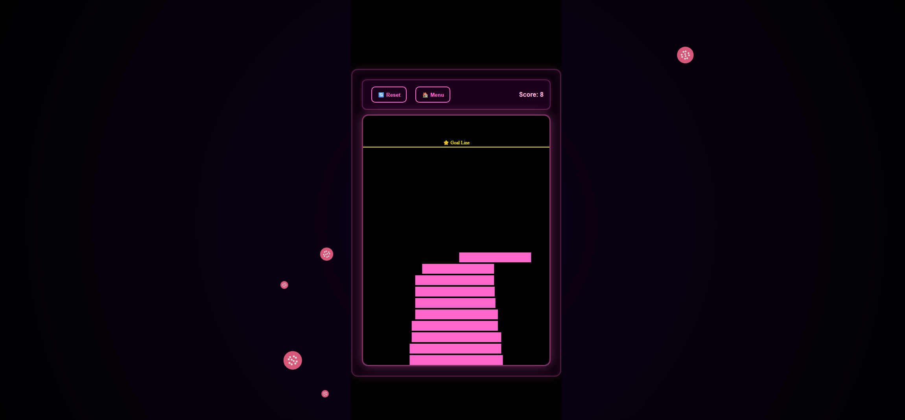

# 🗼 Sentient Tower

**Sentient Tower** is a fast-paced reflex and precision stacking game built with **HTML5 Canvas**, **JavaScript**, and **CSS3**.  
Your goal is to **build a perfectly aligned tower** that reaches the golden goal line without missing a block!

---

## 🎮 Gameplay Overview

- 🧱 Stack moving blocks as high as you can  
- ⭐ Reach the **goal line** to win  
- 💀 Miss the block — and your tower collapses  
- ⚡ Choose difficulty: Easy / Medium / Hard  
- 🔄 Reset or Restart anytime  
- ⏱️ Quick countdown before each round  

Link: https://sentient-tower.vercel.app

---

## 🧩 Features

- Smooth **canvas-based animation**  
- Dynamic difficulty with increasing speed  
- Responsive design (works on desktop & mobile)  
- Intuitive **click** or **spacebar** controls  
- Minimal neon-inspired visual style  
- Win/Lose popups with replay options  
- Fully modular and easy to customize  

---

